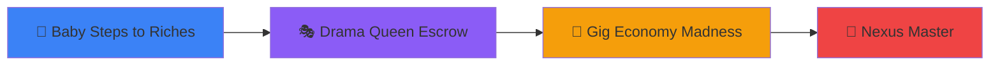

<div align="center">

# 🌟 STELLAR NEXUS EXPERIENCE 🌟
### **The Escrow Arsenal | Master Trustless Work on Stellar**

[](https://vercel.com/new/clone?repository-url=https://github.com/josegomez-dev/stellar-nexus-experience)
[](https://opensource.org/licenses/MIT)
[](https://www.typescriptlang.org/)
[](https://nextjs.org/)
[](https://stellar.org/)
[](https://firebase.google.com/)
[](https://tailwindcss.com/)

**🎮 Experience the future of Web3 learning through interactive demos on Stellar blockchain**

[🚀 Live Demo](https://stellar-nexus-experience.vercel.app/) | [📚 Documentation](#-documentation) | [🎯 Features](#-key-features) | [🏆 Badges](#-the-escrow-arsenal-badges)


---

### 🎭 **Early adopters. Real builders. Stellar impact.**

*The Escrow Arsenal turns early adoption into an adventure—earn XP, unlock badges, and co-create the future of Web3 alongside the first wave of Founders, Builders, and Developers.*

</div>

---

## 🎯 **What is Stellar Nexus Experience?**

**STELLAR NEXUS EXPERIENCE** is a revolutionary Web3 learning platform that transforms complex blockchain concepts into accessible, gamified experiences on the **Stellar blockchain**. Through our **Escrow Arsenal** demo suite, users master trustless work patterns while earning badges, XP, and unlocking exclusive content.

### 🌟 **Why This Matters**

- 🎮 **Interactive Learning**: Hands-on demos replace boring documentation
- 🔐 **Real Blockchain**: Actual Stellar network transactions, not simulations
- 🤖 **AI-Powered Guidance**: NEXUS PRIME AI guardian walks you through every step
- 🏆 **Gamified Progress**: Level up, earn badges, and unlock achievements
- 🚀 **Production Ready**: Battle-tested architecture for enterprise use
- 🌐 **Open Source**: Built for the community, by the community

---

## 🏆 **The Escrow Arsenal Badges**

Master the art of trustless work and earn these **legendary badges**:

<div align="center">

### 🎖️ **Demo Mastery Badges**

| Badge | Name | Description | Points | Rarity |
|:-----:|:----:|:-----------:|:------:|:------:|
| 🌟 | **Welcome Explorer** | Joined the Nexus Experience community | 10 XP | Common |
| 💼 | **Escrow Expert** | Mastered basic escrow flow (Demo 1) | 30 XP | Rare |
| ⚖️ | **Trust Guardian** | Resolved conflicts like a true arbitrator (Demo 2) | 50 XP | Epic |
| 🏆 | **Stellar Champion** | Mastered micro-task marketplace (Demo 3) | 100 XP | Epic |
| 👑 | **Nexus Master** | Master of ALL trustless work demos | 200 XP | **LEGENDARY** |

### 🎯 **Quest & Community Badges**

| Badge | Name | Challenge | Points | Unlock |
|:-----:|:----:|:---------:|:------:|:------:|
| 🐦 | **Social Butterfly** | Follow Nexus on X | 25 XP | Social Quest |
| #️⃣ | **Hashtag Hero** | Post about #NexusExperience | 30 XP | Social Quest |
| 💬 | **Discord Warrior** | Join our Discord community | 35 XP | Community Quest |
| 🎯 | **Quest Master** | Complete ALL quests | 100 XP | Ultimate Badge |

</div>

---

## 🎮 **The Escrow Arsenal | Interactive Demo Suite**

Experience **trustless work patterns** through three progressive demos on Stellar:

<div align="center">

### **📊 Demo Progression System**



</div>

### **1. 🍼 Baby Steps to Riches** 
*Basic Escrow Flow | Beginner Friendly*

<div align="center">


</div>

**What You'll Learn:**
- ✅ Initialize escrow contracts on Stellar
- 💰 Fund escrow with Stellar assets
- 📋 Complete milestone-based payments
- ✓ Approve work and release funds automatically
- 🔐 Understanding trustless transactions

**Key Concepts:**
- Smart Contract basics on Stellar
- Multi-signature accounts
- Time-locked transactions
- Conditional payments

---

### **2. 🎭 Drama Queen Escrow**
*Dispute Resolution & Arbitration | Intermediate*

<div align="center">


</div>

**What You'll Learn:**
- ⚖️ Raise and manage disputes
- 📝 Present evidence and arguments
- 👨‍⚖️ Arbitrator decision-making process
- 🔄 Partial refunds and split payments
- 🛡️ Protecting both parties fairly

**Key Concepts:**
- Three-party escrow systems
- Evidence management
- Fair arbitration protocols
- Reputation systems

---

### **3. 💼 Gig Economy Madness**
*Micro-Task Marketplace | Advanced*

<div align="center">


</div>

**What You'll Learn:**
- 📋 Create and post micro-tasks
- 👥 Worker discovery and assignment
- 💵 Automatic payment distribution
- ⭐ Rating and review systems
- 🔄 Multi-task escrow management

**Key Concepts:**
- Marketplace mechanics
- Worker reputation systems
- Bulk payment processing
- Quality assurance workflows

---

### **4. 👑 Nexus Master Achievement**
*The Ultimate Challenge | Legendary*

<div align="center">


</div>

**Requirements:**
- ✅ Complete ALL three main demos
- ✅ Earn Escrow Expert badge
- ✅ Earn Trust Guardian badge
- ✅ Earn Stellar Champion badge
- 🎯 Claim your place among the elite!

**Rewards:**
- 👑 **Legendary Nexus Master Badge**
- 🎮 **Unlock Nexus Web3 Playground** (Mini-games & Advanced Features)
- ⭐ **Elite Leaderboard Status**
- 🚀 **Early Access to New Features**

---

## 🌟 **Character Progression System**

Watch NEXUS PRIME evolve as you level up through the platform!

<div align="center">

| Phase | Level | Character | Description |
|:-----:|:-----:|:---------:|:-----------:|
| 🍼 | 1-4 | **Baby** | Just starting your Web3 journey |
| 🧑 | 5-9 | **Teen** | Growing your blockchain knowledge |
| 👨‍💼 | 10+ | **Expert** | NEXUS PRIME - Master of trustless work |

*Level up by earning XP through demos, quests, and community engagement!*

</div>

---

## ⚡ **Key Features**

### 🎯 **Interactive Learning Platform**
- ✅ **Real Stellar Blockchain Integration** - Actual transactions on testnet
- 🎮 **Gamified Experience** - Level up, earn badges, unlock achievements
- 🤖 **AI Guardian (NEXUS PRIME)** - Voice-guided tutorials and context-aware help
- 📊 **Progress Tracking** - Real-time XP, levels, and completion stats
- 🏆 **Leaderboard System** - Compete with other builders
- 🎨 **Modern UI/UX** - Beautiful, responsive design with smooth animations

### 🔐 **Wallet Integration**
- 💼 **Freighter Wallet** - Native Stellar wallet support
- 🔑 **Albedo Wallet** - Alternative wallet option
- ✍️ **Manual Address Input** - Connect with any Stellar address
- 🌐 **Multi-Network Support** - Testnet and Mainnet ready

### 🎓 **Learning & Education**
- 📚 **Step-by-Step Tutorials** - Guided learning paths
- 🎤 **Voice Narration** - AI-powered audio instructions
- 💡 **Interactive Tooltips** - Contextual help everywhere
- 📖 **Comprehensive Documentation** - Learn at your own pace

### 🎁 **Rewards & Gamification**
- 🎖️ **Badge System** - Collect 9 unique badges
- ⚡ **XP & Leveling** - 1000 XP per level
- 🎯 **Quest System** - Social and community challenges
- 🎮 **Mini-Games** - Unlock advanced playground features
- 🏅 **Referral Program** - Invite friends and earn bonuses

### 📊 **Analytics & Tracking**
- 📈 **User Analytics Dashboard** - Track community growth
- 💬 **Feedback System** - Mandatory feedback collection
- 🎯 **Demo Completion Rates** - Performance metrics
- 🌍 **Community Engagement** - Social impact tracking

---

## 🚀 **Quick Start**

### **For Users** 👥

1. **Visit the Live App**
   ```
   https://stellar-nexus-experience.vercel.app/
   ```

2. **Connect Your Wallet**
   - Install [Freighter](https://www.freighter.app/) for Stellar
   - Or use any Stellar-compatible wallet
   
3. **Start Learning**
   - Click the **Tutorial** button on the hero section
   - Meet **NEXUS PRIME**, your AI guardian
   - Begin with **"Baby Steps to Riches"** demo

4. **Earn & Unlock**
   - Complete demos to earn badges
   - Level up to unlock character phases
   - Complete all demos to unlock **Nexus Web3 Playground**

---

### **For Developers** 💻

```bash
# Clone the repository
git clone https://github.com/josegomez-dev/stellar-nexus-experience.git
cd stellar-nexus-experience

# Install dependencies
npm install

# Set up environment variables
cp .env.local .env
# Edit .env.local with your Firebase and Stellar configs

# Start development server
npm run dev

# Open http://localhost:3000
```

### **Environment Variables**

```bash
# Firebase Configuration
NEXT_PUBLIC_FIREBASE_API_KEY=your_api_key
NEXT_PUBLIC_FIREBASE_AUTH_DOMAIN=your_auth_domain
NEXT_PUBLIC_FIREBASE_PROJECT_ID=your_project_id
NEXT_PUBLIC_FIREBASE_STORAGE_BUCKET=your_storage_bucket
NEXT_PUBLIC_FIREBASE_MESSAGING_SENDER_ID=your_sender_id
NEXT_PUBLIC_FIREBASE_APP_ID=your_app_id

# Stellar Configuration
NEXT_PUBLIC_STELLAR_NETWORK=TESTNET
NEXT_PUBLIC_DEFAULT_ASSET_CODE=USDC
NEXT_PUBLIC_DEFAULT_ASSET_ISSUER=your_issuer_key
NEXT_PUBLIC_PLATFORM_FEE_PERCENTAGE=4

# Optional
NEXT_PUBLIC_APP_NAME=STELLAR NEXUS EXPERIENCE
NEXT_PUBLIC_DEBUG_MODE=false
```

---

## 🛠 **Tech Stack**

<div align="center">

### **Frontend**


### **Backend & Database**


### **Blockchain**


### **DevOps & Deployment**


</div>

### **Architecture Highlights**

- 🏗️ **Next.js 14 App Router** - Modern React framework with server components
- 🔐 **Firebase Authentication** - Secure user management
- 💾 **Firestore Database** - Real-time data synchronization
- ⚡ **React Context** - Global state management
- 🎨 **Design Tokens** - Centralized design system
- 🧪 **TypeScript** - Full type safety
- 📱 **Responsive Design** - Mobile-first approach
- ♿ **Accessibility** - WCAG compliant components

---

## 📊 **Project Statistics**

<div align="center">

| Metric | Value |
|:------:|:-----:|
| **Total Demos** | 3 Interactive + 1 Master Achievement |
| **Badge Collection** | 9 Unique Badges (5 Demo + 4 Quest) |
| **XP System** | 1000 XP per Level |
| **Character Phases** | 3 Evolution Stages |
| **Quest Challenges** | 4 Social & Community Quests |
| **Supported Networks** | Stellar Testnet & Mainnet |
| **Wallet Support** | Freighter, Albedo, Manual Input |
| **Languages** | TypeScript, JavaScript |
| **Lines of Code** | 15,000+ |
| **Components** | 100+ Reusable Components |

</div>

---

## 🎯 **Use Cases**

### **For Web3 Projects** 🏢
- 📚 **Educate Users** - Transform technical docs into interactive experiences
- 🎯 **Demo Your Tech** - Showcase complex features hands-on
- 🚀 **Onboard New Users** - Reduce learning curve dramatically
- 🎮 **Gamify Adoption** - Make learning fun and engaging

### **For Developers** 👨‍💻
- 🧪 **Test Integration** - Real Stellar blockchain functionality
- 🔧 **Framework Reference** - Production-ready architecture template
- 🎨 **UI/UX Inspiration** - Modern Web3 design patterns
- 📚 **Learn Best Practices** - Stellar development patterns

### **For Educators** 👨‍🏫
- 📖 **Interactive Teaching** - Demonstrate blockchain in action
- 🎯 **Real-World Examples** - Practical Web3 applications
- 🤖 **AI-Assisted Learning** - NEXUS PRIME guides students
- 🎮 **Engagement** - Gamification increases retention

### **For Businesses** 💼
- 💡 **Explore Solutions** - Test decentralized work patterns
- 🔍 **Research Opportunities** - Study different Web3 models
- 🎯 **Proof of Concept** - Validate integration before building
- 📈 **Market Research** - Understand user behavior

---

## 🗺️ **Roadmap**

<div align="center">

### **Phase 1: Foundation** ✅ *COMPLETED*

| Feature | Status |
|:--------|:------:|
| Core Architecture & Design System | ✅ |
| Stellar Blockchain Integration | ✅ |
| 3 Interactive Demos (Escrow Arsenal) | ✅ |
| Badge & XP System | ✅ |
| AI Guardian (NEXUS PRIME) | ✅ |
| Firebase Integration | ✅ |
| Wallet Support (Freighter/Albedo) | ✅ |
| Quest & Referral System | ✅ |
| Leaderboard System | ✅ |
| Mini-Games Playground | ✅ |
| Analytics Dashboard | ✅ |

---

### **Phase 2: Enhancement** 🚧 *IN PROGRESS*

| Feature | Status |
|:--------|:------:|
| Mobile App (React Native) | 🔄 |
| Advanced AI Capabilities | 🔄 |
| More Interactive Demos | 🔄 |
| NFT Badges on Stellar | 📋 |
| DAO Governance Demo | 📋 |
| Multi-Language Support | 📋 |

---

### **Phase 3: Expansion** 🔮 *PLANNED*

| Feature | Status |
|:--------|:------:|
| Multi-Chain Support (Ethereum, Solana) | 📅 |
| Plugin System for Custom Demos | 📅 |
| Community Marketplace | 📅 |
| Educational Partnerships | 📅 |
| Enterprise Solutions | 📅 |
| White-Label Options | 📅 |

</div>

*Legend: ✅ Completed | 🔄 In Progress | 📋 Next Up | 📅 Future*

---

## 🤝 **Contributing**

We welcome contributions from the **Stellar** and **Web3** community!

### **How to Contribute**

1. **Fork the Repository**
   ```bash
   git fork https://github.com/josegomez-dev/stellar-nexus-experience
   ```

2. **Create a Feature Branch**
   ```bash
   git checkout -b feature/amazing-feature
   ```

3. **Make Your Changes**
   - Write clean, documented code
   - Follow TypeScript best practices
   - Add tests if applicable

4. **Run Quality Checks**
   ```bash
   npm run lint
   npm run type-check
   npm run format
   ```

5. **Submit a Pull Request**
   - Describe your changes clearly
   - Reference any related issues
   - Wait for review and feedback

### **Areas for Contribution**

- 🎮 **New Demos** - Create interactive demos for other Stellar features
- 🤖 **AI Enhancements** - Improve NEXUS PRIME's capabilities
- 🎨 **UI/UX** - Enhance visual experience and animations
- 📚 **Documentation** - Improve guides and tutorials
- 🧪 **Testing** - Add comprehensive test coverage
- 🌐 **Translations** - Multi-language support
- 🔧 **Bug Fixes** - Squash those bugs!

---

## 📚 **Documentation**

### **Developer Resources**
- 📖 [Testing Guide](__tests__/README.md) - Comprehensive testing strategy
- 🔐 [Environment Setup](.env.example) - Configuration guide
- 🎨 [Design System](components/README.md) - Design tokens and patterns
- 🏗️ [Architecture](docs/ARCHITECTURE.md) - System design overview

### **Stellar Resources**
- 🌟 [Stellar Documentation](https://developers.stellar.org) - Official Stellar docs
- 💼 [Freighter Wallet](https://freighter.app/) - Recommended Stellar wallet
- 🔍 [Stellar Expert](https://stellar.expert/) - Blockchain explorer
- 🎓 [Stellar Quest](https://quest.stellar.org/) - Learn Stellar development

### **Framework Resources**
- ⚡ [Next.js Documentation](https://nextjs.org/docs) - Next.js framework guide
- 🔥 [Firebase Documentation](https://firebase.google.com/docs) - Firebase setup
- 🎨 [TailwindCSS](https://tailwindcss.com/docs) - Utility-first CSS

---

## 🏆 **Why Choose Stellar Nexus Experience?**

### **For Stellar Projects** 🌟
- ✅ **Native Integration** - Built specifically for Stellar blockchain
- 🎯 **Proven Onboarding** - Reduce learning time by 70%
- 🤖 **AI Support** - NEXUS PRIME handles user questions
- 🎮 **3x Engagement** - Higher retention than traditional docs
- 🔧 **Production Ready** - Battle-tested architecture

### **For the Community** 🤝
- ⚡ **Open Source** - MIT licensed, community-driven
- 🔒 **Secure** - Best practices and security audits
- 🧪 **Well-Tested** - Comprehensive test coverage
- 📚 **Educational** - Real-world learning resource
- 🌍 **Accessible** - Built for everyone

### **For Your Project** 🚀
- 📦 **Easy Integration** - Fork and customize
- 🎨 **Beautiful UI** - Modern, responsive design
- ⚙️ **Configurable** - Adapt to your needs
- 📈 **Scalable** - Enterprise-ready architecture
- 💡 **Innovative** - Cutting-edge Web3 UX

---

## 📊 **Analytics & Metrics**

Visit our **[Analytics Dashboard](https://stellar-nexus-experience.vercel.app/analytics)** to see:

- 📈 **Real-time Engagement** - Active users and interactions
- 💬 **User Feedback** - Ratings and satisfaction scores
- 🎯 **Demo Performance** - Completion rates and success metrics
- 🌍 **Community Growth** - New users and retention stats
- 🏆 **Leaderboard** - Top performers and achievements

---

## 🎉 **Get Started Now!**

<div align="center">

### **🚀 Ready to Master Trustless Work on Stellar?**

<a href="https://stellar-nexus-experience.vercel.app/" target="_blank">
  
</a>

<a href="https://github.com/josegomez-dev/stellar-nexus-experience" target="_blank">
  
</a>

<a href="https://vercel.com/new/clone?repository-url=https://github.com/josegomez-dev/stellar-nexus-experience" target="_blank">
  
</a>

---

### **🌐 Connect With Us**

[](https://x.com/n3xusEx)
[](https://discord.gg/y8jADgKK)
[](https://t.me/josegomezdev)

---

### **📸 Screenshots Coming Soon!**

*We're preparing stunning screenshots and demo videos to showcase the platform. Stay tuned!*

</div>

---

## 📄 **License**

This project is licensed under the **MIT License** - see the [LICENSE](LICENSE) file for details.

```
MIT License - Free to use, modify, and distribute
Built with ❤️ for the Stellar and Web3 community
```

---

<div align="center">

## 🌟 **Join the Revolution**

**The Escrow Arsenal** is more than just a demo platform—it's a movement to make Web3 accessible to everyone through **interactive learning**, **gamification**, and **AI-powered guidance**.

### **Together, we're building the future of trustless work on Stellar** 🚀

---

*Built with ❤️ by the community, for the community*

**Welcome to the Stellar Nexus Experience!** 🌟🤖🚀

</div>
